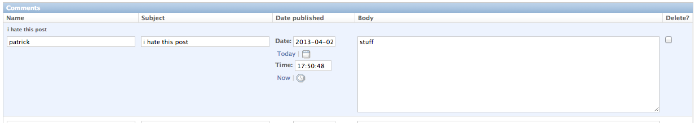

% Django Workshop
% Patrick Butler
% April 4th, 2013

# Django
  - \url{http://djangoproject.com}
  - Django is a modern web frame work in the style of Ruby on Rails, PHPCake, etc
  - Presents an MVC style of programming
    - Model -- your data
    - View -- the HTML frontend
    - Controller -- the logic to process, modify, and return data
  - ORM -- Object relational mapping, data is mapped to classes which are mapped to a database

# Installing Django
  - On OS X or Linux
    - `easy_install django` 

       or

    - `pip install django`

  - A bit harder on a Windows machine:  download:
	 \url{http://pipe.cs.vt.edu/~pbutler/django-python.zip}

# Goal for Today
 - Design and create a simple Blog application

# Django Structure
 - Project -- this is your site and is made up of one or more apps
 - Apps  -- These are services your site offers. 
   - Other examples of apps:
     - Polls
     - Blog
     - Comments

# Starting a Django project
  - `django-admin.py startproject mysite`
  - `mysite/`
    - `manage.py`
    - `mysite/`
      - `__init__.py`
      - `settings.py` -- website settings
      - `urls.py` -- the lay out of the site
      - `wsgi.py` -- for interfacing with webservers

# settings.py
- At a minimum you need to setup your database:
    - Setup `DATABASES`:
        - `'ENGINE': 'django.db.backends.sqlite3'`
        - `'NAME': 'database.sqlite'`

 - settings.py -- default apps
  - django.contrib.auth -- An authentication system.
  - django.contrib.contenttypes -- A framework for content types.
  - django.contrib.sessions -- A session framework.
  - django.contrib.sites -- A framework for managing multiple sites with one Django installation.
  - django.contrib.messages -- A messaging framework.
  - django.contrib.staticfiles -- A framework for managing static files.

# Starting a Django App
 - `manage.py startapp blog`
 - `mysite/`
   - `manage.py`
   - `mysite/`
     - ...
   - `blog/`
     - `__init__.py`
     - `models.py` -- defines models and datatypes
     - `tests.py` -- we'll just ignore this for now
     - `views.py` -- describes logic for displaying and modifying models

# models.py
  - Models are sub-classed from django.db.models.Model
  - Defined using class level variables to describe the fields
  - Example Field Types:
     - models.CharField
     - models.DateTimeField
     - models.ForeignKey
     - models.IntegerField
     - etc
  - After we create the models we can create the database by running:
    `python manage.py syncdb`
  - Or clear the database via:

# Models Examples
~~~~~~~~~~~~~~~~~~~~~~~~~~~~~~~python
from django.db import models

class Poll(models.Model):
    question = models.CharField(max_length=200)
    pub_date = models.DateTimeField('date published')

    def __unicode__(self):
        return self.question

class Choice(models.Model):
    poll = models.ForeignKey(Poll)
    choice_text = models.CharField(max_length=200)
    votes = models.IntegerField(default=0)
~~~~~~~~~~~~~~~~~~~~~~~~~~~~~~~

# Excercise 1
  - Create a model called Entry
  - It should contain fields for
    - Title
    - Published time
    - Body -- use models.TextField
    - unicode should return the title

# Answer 1
~~~~python
class Entry(models.Model):
    title = models.CharField(max_length=200)
    pub_date = models.DateTimeField('date published')
    body = models.TextField()
    
    def __unicode__(self):
        return self.title
~~~~

# Django shell
  - Allows us to interact with models on the command line
  - `./manage.py shell`
  - Useful methods for models:
    - `Entry.objects.all()` -- select all instances of model
    - `Entry.objects.filter(title__starts_with="Life") 
                   .exclude(body__contains="girlfriend")`
    - `Entry.objects.all().count()`
    - `Entry.objects.all()[:5]`
    - `model = Entry.objects.get(id=1)`
    - `model.body = "New body"; model.save()`
    - `model.delete()`

# Console session summary
~~~~python
>>> from blog.models import Entry
>>> Entry.objects.all()
[]

>>> from django.utils import timezone
>>> e = Entry(title="My life", 
              pub_date=timezone.now(), 
              body="I hate my emo life.")

# Save the object into the database. 
# You have to call save() explicitly.
>>> e.save()
~~~~

# Console session summary pt2
~~~python
>>> e.id
1

>>> Entry.objects.all()
[<Entry: My life>]
>>> e.delete()
~~~

# Admin interface 
 - Django provides a ready made interface for accessing your models. 
 - In general provides a quick and easy way to create a set of forms to modify and create new data
 - Includes features such as ACLs, groups, users, etc
 - To install:
   - In settings.py: uncomment `"django.contrib.admin"` in the `INSTALLED_APPS`
   - run: `python manage.py syncdb`
   - modify `mysite/urls.py`

# Admin interface -- urls.py 
\small

~~~python
from django.conf.urls import patterns, include, url

# Uncomment the next two lines to enable the admin:
from django.contrib import admin
admin.autodiscover()

urlpatterns = patterns('',
    # Examples:
    # url(r'^$', '{{ project_name }}.views.home', name='home'),
    # url(r'^{{ project_name }}/', include('{{project_name}}.foo.urls')),

    # Uncomment the admin/doc line below to enable admin documentation:
    # url(r'^admin/doc/', include('django.contrib.admindocs.urls')),

    # Uncomment the next line to enable the admin:
    url(r'^admin/', include(admin.site.urls)),
)
~~~

# Admin Interface -- admin.py
 - Create `mysite/blog/admin.py`:

~~~python
from django.contrib import admin
from blog.models import Entry

admin.site.register(Entry)
~~~

# The Development Server
  - To run a development server 
    - `python manage.py runserver`
  - This will autodetect changes and reload files as needed
  - Will output various debugging information

# Admin Inteface
  - Browse to `http://localhost:8000/admin`
  - Explore and add a blog entry
  - Customizing the Admin Interface

~~~python
class EntryAdmin(admin.ModelAdmin):
  fields = ['title', 'pub_date', 'body']
  list_display = ('pub_date', 'title')
  search_fields = ['title']
  date_hierarchy = 'pub_date'
  list_filter = ['pub_date']

admin.site.register(Entry, EntryAdmin)
~~~

# Views & Controllers
  - `mysite/blog/urls.py` -- contain information on the layout of the app
  - `mysite/blog/views.py` -- The logic of the app, Python code goes here
  - `mysite/blog/templates/blog` -- templates, html and  template language

# Views we want for our site
## List View -- lists all entries by date and title for example:
 - 4:00pm April 29th , 2013 -- I stubbed my toe
 - 6:00pm April 29th , 2013 -- I stubbed my toe again
 - 4:00am April 30th , 2013 -- I can't sleep my toe hurts

## Detail view -- lists a single entry
### I stubbed my toe
   April 29th, 2013 4:00pm

My durn cat ran out from under me and scared me into banging my toe on the steps.  Blah blah blah

# views.py
- Contains the logic that renders the webpage.
- Each view consists of a function that renders that view for ex:

~~~python
def list(request):
  return HttpResponse("You're looking at a listing of"
                      " polls")

def results(request, poll_id):
  return HttpResponse("You're looking at detail view for "
                      "poll_id %s." % poll_id)
~~~

# urls.py
  - There are two levels of urls.py:
    - Project level which describes how the top level layout of the views
      - `mysite/mysite/urls.py`
    - App level which describe how each app is laid out inside of a subdirectory
      - `mysite/blog/urls.py`
 
# Project level urls.py
  - We must tell the project where to place the app
  - Add the following line to mysite/mysite/urls.py
    - `url(r'^blog/', include('blog.urls')),`

# App level urls.py

~~~~~~~~~~~~~~~~~~~~~~~~~~~~~~~~~~~~~~~~~~~~~python
from django.conf.urls import patterns, url
from polls import views

urlpatterns = patterns('',
    # ex: /polls/
    url(r'^$', views.index),
    # ex: /polls/5/
    url(r'^(?P<poll_id>\d+)/$', views.detail),
    # ex: /polls/5/results/
    url(r'^(?P<poll_id>\d+)/results/$', views.results),
    # ex: /polls/5/vote/
    url(r'^(?P<poll_id>\d+)/vote/$', views.vote),
)
~~~~~~~~~~~~~~~~~~~~~~~~~~~~~~~~~~~~~~~~~~~~~

\small

 - `url(regex, view, kwargs, name)`
 - regex -- a Python regular expression describing the url.
 - `^` means start of line, `$` means end of line, `\d` means numbers, `+` means 1 or more
  We can use the special `(?P<argname>\w+)` magic to parse argument values from the 
 - view -- the view function used to render the this url

# Exercise #2 urls.py
 - Create a urls.py that calls the following 2 views
 - /blog/list that displays the list view
 - /blog/entry/id that displays the detail view

~~~~~~~~~~~~~~~~~~~~~~~~~~~~~~~~~~~~~~~~~~~~~python
from django.conf.urls import patterns, url
from blog import views

urlpatterns = patterns('',
    # your code goes hereex: /polls/
    url(r'^$', views.index),
    # ex: /polls/5/
    url(r'^(?P<poll_id>\d+)/$', views.detail),
    # ex: /polls/5/results/
    url(r'^(?P<poll_id>\d+)/results/$', views.results),
    # ex: /polls/5/vote/
    url(r'^(?P<poll_id>\d+)/vote/$', views.vote),
)
~~~~~~~~~~~~~~~~~~~~~~~~~~~~~~~~~~~~~~~~~~~~~

# Exercise #2 urls.py -- Answers
- Create a urls.py that calls the following 2 views
     - `/blog/list` that displays the list view
     - `/blog/entry/<id>` that displays the detail view

~~~python
from django.conf.urls import patterns, url
from blog import views

urlpatterns = patterns('',
    # your code goes here
    url(r'^list$', views.list),
    # ex: /entry/5/
    url(r'^entry/(?P<entry_id>\d+)/$', views.detail),
)
~~~

# Exercise #3
- Modify the previous two view functions (views.py)
    - list -- output a comma separated list of titles of entries 
    - detail -- ouput the body of the entry

- Useful tools:
    - `Entry.objects.all()`
    - `Entry.objects.get(id=entry_id)`

- Start with:

~~~python
from blog.models  import Entry 
def list(request):
  return HttpResponse("You're looking at a listing of"
                      " entries")

def results(request, entry_id):
  return HttpResponse("You're looking at detail view for"
                      "entry_id %s." % entry_id)
~~~

# Exercise #3 -- Answers
~~~python
from blog.models  import Entry 

def list(request):
  entries = Entry.objects.all()
  response = ",".join(e.title for e in entries)
  return HttpResponse(entries)

def results(request, entry_id):
  entry = Entry.objects.get(id=entry_id)
  return HttpResponse(entry.title)
~~~

# Templates
 - Templates allow us to abstract away the layout from the data
 - Use a templating language that can be embedded into standard HTML
 - `/mysite/blog/templates/blog`

# Django templates
  - `{{ variable }}` -- replace with a variable
  - `` embed code in html
  - `  ` -- if statement
  - ` ` -- for loop

# Django Templates

~~~html

    <ul>
    
        <li><a href="/polls/{{ poll.id }}/">
              {{ poll.question }}</a></li>
    
    </ul>

    
No polls are available.


~~~

# Rendering Django Templates
- Templates can be rendered using 
  `django.shortcuts.render(request, template, context)`
    - template -- filename of the template to use
    - context -- a dictionary defining the variables to be passed to the template

\small 

~~~python
from django.shortcuts import render

from polls.models import Poll

def index(request):
    latest_poll_list = Poll.objects.all().order_by('-pub_date')[:5]
    context = {'latest_poll_list': latest_poll_list}
    return render(request, 'polls/index.html', context)
~~~

# Exercise #4a
 - Rewrite our views.py so that they render a template instead of just a string

 - use: `from django.shortcuts import render`

# Exercise #4a
 - Rewrite our views.py so that they render a template instead of just a string

~~~python
from blog.models  import Entry 
from django.shortcuts import render

def list(request):
  entries = Entry.objects.all()
  context = {'entries': entries}
  return render(request, 'blog/list.html',
                context)
def detail(request, entry_id):
  entry = Entry.objects.get(id=entry_id)
  context = {'entry': entry}
  return render(request, 'blog/detail.html',
                context)
~~~

# Exercise #4b
  - Create a sane template for list.html and detail.html

  - Useful things:
    - `{{variable}}` prints the variable
    - `` loops over the variable 

# Exercies #4b -- detail.html

~~~html
<h1>{{entry.title}}</h1>
{{entry.pub_date}}

{{entry.body}}

~~~

# Exercise #4b -- list.html
\small

~~~html
<ul>
  
   <li> {{entry.pub_date}} --
            <a href="entry/{{entry.id}}">{{entry.title}}</a> </li>

</ul>
~~~

# Now what?
 - Comments
 - Each comment refers to a post so our comments must take this into account
 - To do this we use the `django.db.models.ForeignKey` field
  - `models.ForeignKey(ModeltoRelateto)`

# Exercise #5
 - Make a comment class/model

# Exercise #5 -- Answer

~~~python
class Comment(models.Model):
    name = models.CharField(max_length=200)
    subject = models.CharField(max_length=200)
    entry = models.ForeignKey(Entry)
    pub_date = models.DateTimeField('date published')
    body = models.TextField()
    
    def __unicode__(self):
        return self.subject 

~~~

# Create an Admin form for Comments

~~~python
class EntryAdmin(admin.ModelAdmin):
    pass
admin.site.register(Entry, EntryAdmin)
~~~

# Inline Admin Forms 

# Example
~~~python
from django.contrib import admin
from blog.models import Entry, Comment

#class CommentInline(admin.TabularInline):
class CommentInline(admin.StackedInline):
    model = Comment
    extra = 3

class EntryAdmin(admin.ModelAdmin):
    fields = ['title', 'pub_date', 'body']
    list_display = ('pub_date', 'title')
    search_fields = ['title']
    date_hierarchy = 'pub_date'
    list_filter = ['pub_date']
    inlines = [CommentInline]
admin.site.register(Entry, EntryAdmin)
~~~

# Django shell 
\small

~~~python
>>> entry = Entry.objects.get(id=1)
>>> comments = entry.comment_set.all()
[]
>>> comments.create(name="Patrick", subject="I hate your blog",
                     pub_date=entry.pub_date, body="Stop posting")
>>> comments = entry.comment_set.all()
[<Comment:"I hate your blog">]
~~~

# Exercise #6

- Update the template of detail.html to include a listing of the comments
- Hint loop over entry.comment_set.all

# Exercise #6 Answer
\small

~~~html
<h1>{{entry.title}}</h1>
{{entry.pub_date}}

{{entry.body}}

<ul>
  
   <li> {{comment.author}} </li>

</ul>

<table width="50%" border="1" cellspacing="0">
  
  <tr><td>
                  <b>{{comment.subject}}</b> 
                  by: {{comment.name}} 
                      on {{comment.pub_date}}  
                  
 {{comment.body}}

         </td></tr>
 
 </table>
~~~

# Comments urls.py

~~~python
from django.conf.urls import patterns, url
from blog import views

urlpatterns = patterns('',
    # your code goes here
    url(r'^list$', views.list),
    # ex: /entry/5/
    url(r'^entry/(?P<entry_id>\d+)/$', views.detail),
    url(r'^entry/(?P<entry_id>\d+)/comment$', views.comment),
)
~~~

# Comments views.py
\scriptsize

~~~python
from blog.models  import Entry 

from django.shortcuts import get_object_or_404, render
from django.http import HttpResponseRedirect, HttpResponse
from django.utils import timezone

def comment(request, entry_id):
    e = get_object_or_404(Poll, pk=entry_id)
    try:
        new_comment = e.comment_set.create(name=request.POST['name'],
                                           subject=request.POST['subject'],
                                           pub_date=timezone.now(),
                                           body=request.POST['body'])
    except (KeyError, Choice.DoesNotExist):
        # Redisplay the poll voting form.
        return render(request, 'blog/detail.html', {
            'entry': e,
            'error_message': "You screwed up.",
        })
    else:
        # Always return an HttpResponseRedirect after successfully dealing
        # with POST data. This prevents data from being posted twice if a
        # user hits the Back button.
        return HttpResponseRedirect("/blog/entry/%s/" % entry_id)
~~~
